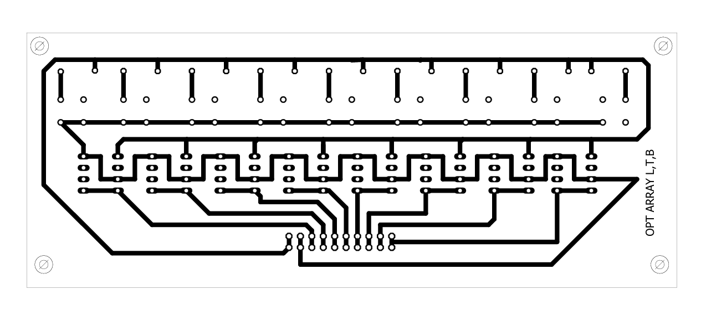

# line-following-three-wheel-omni-drive

Designed and developed a **three‑wheel omni‑directional robot** for the **Robocon competition**.  
The robot autonomously follows a white line using an **OPT101 sensor array**.  
A custom **line-following PID algorithm** was implemented on an **AVR ATmega2560** microcontroller.  
The system leverages **PWM motor control** and **omni-wheel kinematic mapping** to achieve smooth and responsive navigation.

## 🧩 Components

| Component         | Description                             |
|------------------|-----------------------------------------|
| **Microcontroller** | AVR ATmega2560                          |
| **Controller**      | Bluetooth-based PlayStation-style input |
| **Sensor**          | OPT101 analog sensor array (16-channel) |
| **Drive System**    | 3-Wheel Omni-Directional Base           |

## 🛠 Features

- 360° omnidirectional movement
- Autonomous line-following mode
- Manual Bluetooth control mode
- EEPROM-based sensor calibration
- Real-time sensor thresholding
- Emergency stop functionality
- Interrupt-driven UART reception

## 🔧 Schematic

Below is the schematic of the **OPT101 sensor array** used for line detection:

## 📁 Code Structure

Main source file: 

## 🚀 How It Works

1. **Line Follow Mode**  
   Activated via PS2 controller (Cross button).  
   Reads 16 sensors, calculates line position, and applies PID control to adjust direction.

2. **Manual Control Mode**  
   Activated via PS2 controller (Triangle button).  
   Joysticks map to X, Y, and rotation components of the omni drive.

3. **Calibration Mode**  
   Activated via PS2 controller (Start button).  
   Stores max/min sensor values and saves thresholds to EEPROM.

4. **Emergency Stop**  
   Activated via R1 or R2 buttons.  
   Immediately halts all motors.

## 📡 Communication Protocol

- **Bluetooth UART Serial**
- 9600 baud rate
- Custom protocol for analog joystick and digital button signals
- Interrupt-based USART3 handling for minimal latency

## 🧠 Algorithms Used

- **PID Proportional Control** for line deviation correction
- **Vector Decomposition** for omni-drive control
- **Sensor normalization** using runtime calibration
- **Joystick Mapping** from raw input to motor vectors

## 

© Sahil Rajpurkar, 2018, Licensed for academic and personal use only. Commercial use is not permitted without written permission.